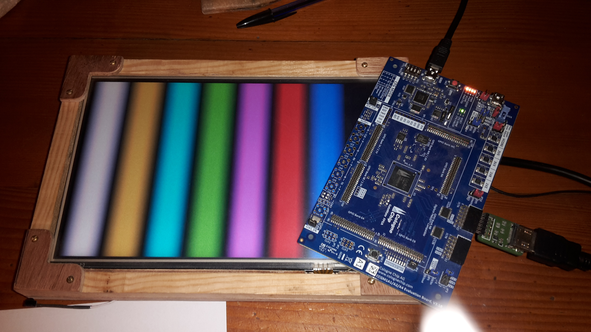

# colorBarDVI

Simple DVI (640x480@60Hz) demonstration using a [Machdyne DDMI Pmod]](https://machdyne.com/product/ddmi-pmod/)
to displays 8 shaded colors bars

```
$ make
```

Note: due to PMOD level shifters **JP14** must be mounted between 2-3 (2v5)


