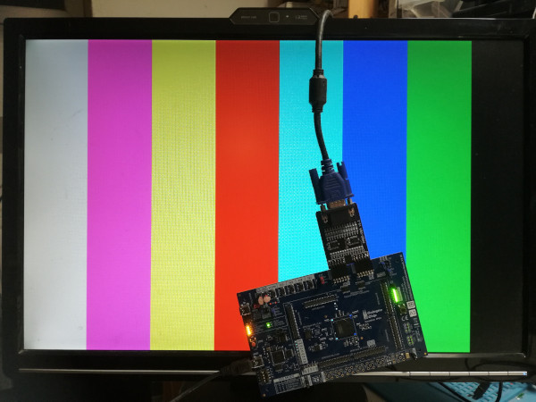

# colorBarVGA

Simple VGA (640x480@60Hz) demonstration using a [Digilent PMOD
VGA](https://digilent.com/reference/pmod/pmodvga/start) to displays 8 colors
bars


To use the design with PMOD-VGA from [Muse
lab](https://www.tindie.com/products/johnnywu/pmod-vga-expansion-board/), add
`VGA=muselab` option to make (colors could be wrong, but syncro will be ok) :

```
$ make VGA=muselab
```


Note: due to PMOD level shifters **JP14** must be mounted between 2-3 (2v5)

- With Digilent adapt :


- With Muse Lab adapt :


